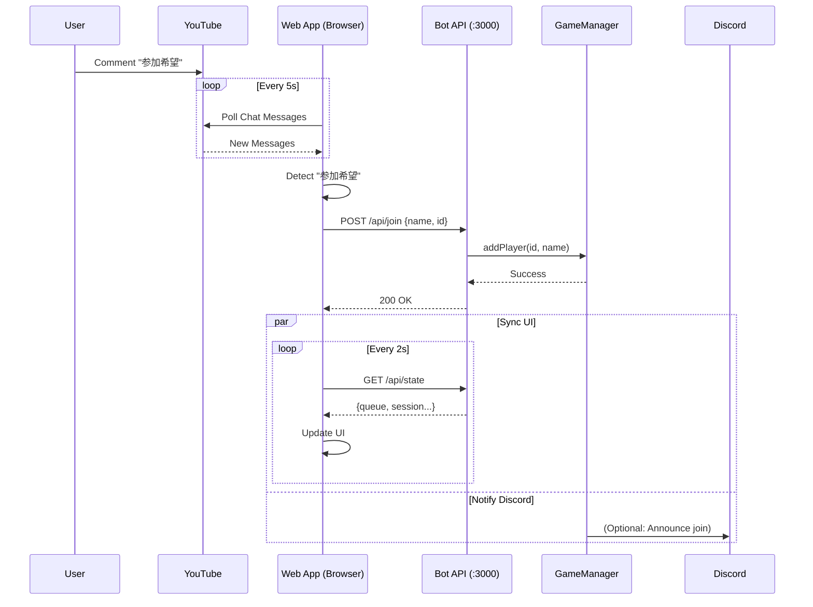
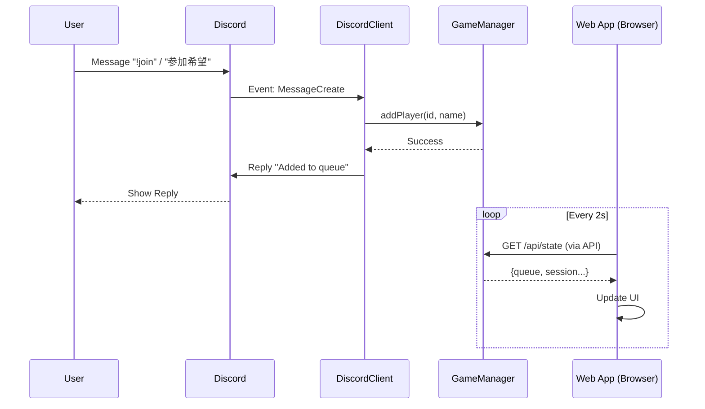
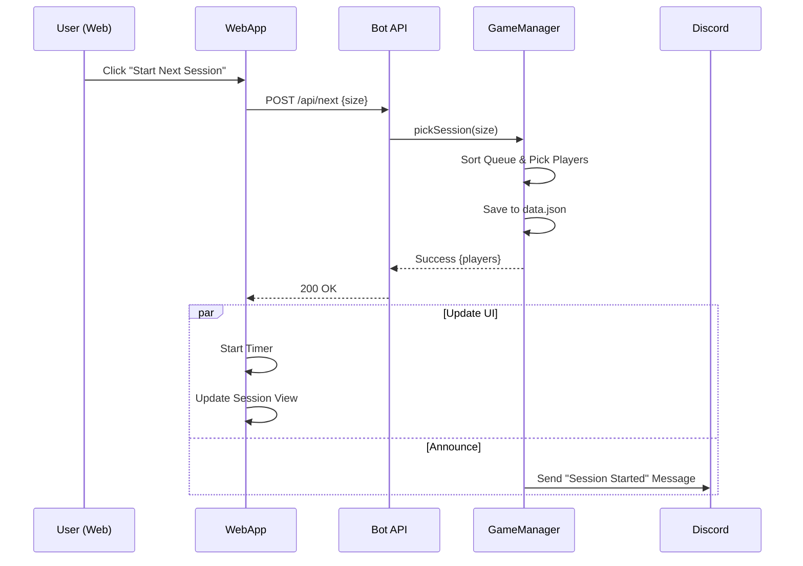

# System Architecture

## Component Diagram

This diagram illustrates the high-level components and their connections.

```mermaid
graph TD
    subgraph "External Services"
        Discord[Discord API]
        YouTube[YouTube Data API]
    end

    subgraph "ParticipationManagerBot (Node.js)"
        DiscordClient[Discord Client]
        APIServer[API Server (Express :3000)]
        GameManager[GameManager (Logic)]
        Storage[Storage]
        DataFile[(data.json)]

        DiscordClient <--> Discord
        DiscordClient --> GameManager
        APIServer --> GameManager
        GameManager --> Storage
        Storage --> DataFile
    end

    subgraph "ParticipationManager (Web App)"
        UI[Vue.js UI]
        BotClient[Bot API Client]
        YTClient[YouTube Client]

        UI --> BotClient
        UI --> YTClient
        YTClient <--> YouTube
    end

    %% Interactions
    BotClient -- "Control & Sync" --> APIServer
    
    classDef service fill:#f9f,stroke:#333,stroke-width:2px;
    classDef component fill:#bbf,stroke:#333,stroke-width:1px;
    classDef storage fill:#ff9,stroke:#333,stroke-width:1px;
    
    class Discord,YouTube service;
    class DiscordClient,APIServer,GameManager,UI,BotClient,YTClient component;
    class DataFile storage;
```

## Sequence Diagrams

### 1. User Joins via YouTube Chat
This flow shows how a YouTube comment ("参加希望") is processed to add a user to the Bot's queue.



### 2. User Joins via Discord
This flow shows how a Discord message ("!join" or "参加希望") is processed.



### 3. Session Management (Web App)
This flow shows how the Web App controls the Bot to start a new session.


